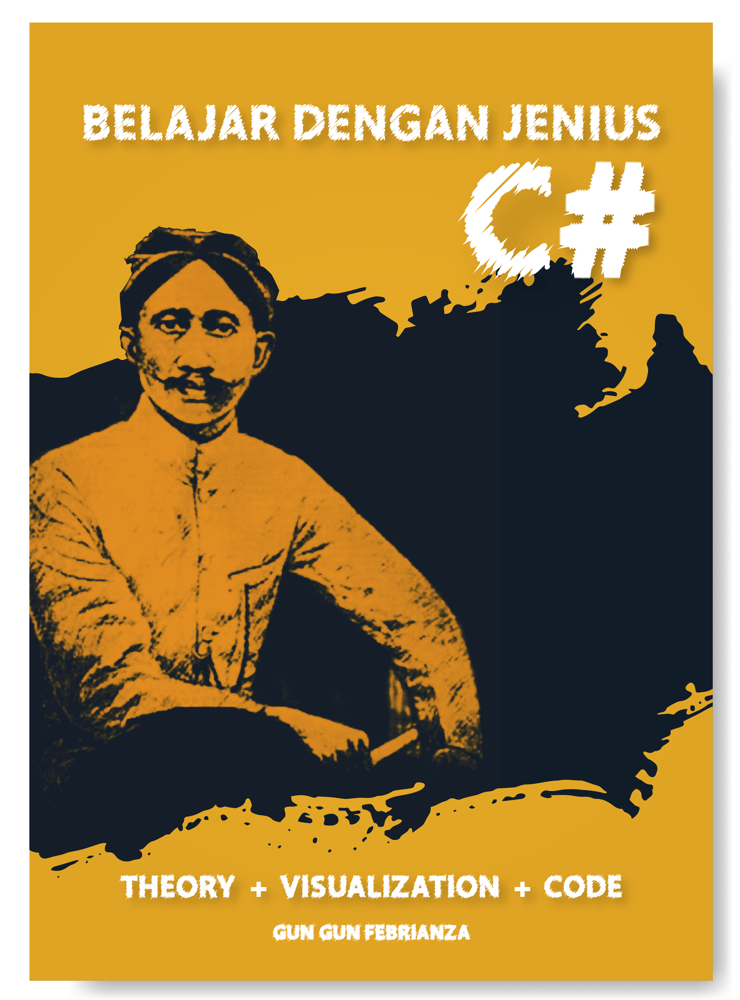

# Belajar Dengan Jenius C#

## Penulis : Gun Gun Febrianza

### Content Table

#### [Programming Paradigm](https://github.com/gungunfebrianza/Belajar-Dengan-Jenius-C-Sharp/blob/master/ebook/ProgrammingParadigm.md)

- ##### [Imperative & Declarative Programming](https://github.com/gungunfebrianza/Belajar-Dengan-Jenius-C-Sharp/blob/master/ebook/ImperativeDeclarative.md)

- ##### [Object-oriented Programming](https://github.com/gungunfebrianza/Belajar-Dengan-Jenius-C-Sharp/blob/master/ebook/ObjectOrientedProgramming.md)

#### [C#](https://github.com/gungunfebrianza/Belajar-Dengan-Jenius-C-Sharp/blob/master/ebook/C%23History.md)

#### Data Type

- Data
- Types
- Data Types
- Strongly & Weakly Typed
- C# Data Type
- C# Data Type Convertion

#### [Runtime Infrastructure](https://github.com/gungunfebrianza/Belajar-Dengan-Jenius-C-Sharp/blob/master/ebook/Runtime%20Infrastructure.md)

- ##### [Two-stage Translation](https://github.com/gungunfebrianza/Belajar-Dengan-Jenius-C-Sharp/blob/master/ebook/TwoStageTranslation.md)

- ##### [Object Code](https://github.com/gungunfebrianza/Belajar-Dengan-Jenius-C-Sharp/blob/master/ebook/ObjectCode.md)

- ##### [Linker](https://github.com/gungunfebrianza/Belajar-Dengan-Jenius-C-Sharp/blob/master/ebook/Linker.md)

- ##### [Loader](https://github.com/gungunfebrianza/Belajar-Dengan-Jenius-C-Sharp/blob/master/ebook/Loader.md)

- ##### [Common Intermediate Language (CIL)](https://github.com/gungunfebrianza/Belajar-Dengan-Jenius-C-Sharp/blob/master/ebook/CIL.md)

- ##### [Assembly](https://github.com/gungunfebrianza/Belajar-Dengan-Jenius-C-Sharp/blob/master/ebook/Assembly.md)

- ##### [Common Language Infrastructure (CLI)](https://github.com/gungunfebrianza/Belajar-Dengan-Jenius-C-Sharp/blob/master/ebook/CLI.md)

- ##### [.Net Framework](https://github.com/gungunfebrianza/Belajar-Dengan-Jenius-C-Sharp/blob/master/ebook/.Net.md)

- ##### [Common Language Runtime (CLR)](https://github.com/gungunfebrianza/Belajar-Dengan-Jenius-C-Sharp/blob/master/ebook/CLR.md)

  - **Managed Code & Unmanaged Code**

- [**Framework Base Class (FBC)**](https://github.com/gungunfebrianza/Belajar-Dengan-Jenius-C-Sharp/blob/master/ebook/BaseClassLibrary.md)

- ##### [Common Type System (CTS)](https://github.com/gungunfebrianza/Belajar-Dengan-Jenius-C-Sharp/blob/master/ebook/CTS.md)

  - **Stack & Heap**

- ##### [Common Language Specification (CLS)](https://github.com/gungunfebrianza/Belajar-Dengan-Jenius-C-Sharp/blob/master/ebook/CLS.md)

- ##### [Dynamic Link Library (DLL)](https://github.com/gungunfebrianza/Belajar-Dengan-Jenius-C-Sharp/blob/master/ebook/Dll.md)

- ##### [Managed Code](https://github.com/gungunfebrianza/Belajar-Dengan-Jenius-C-Sharp/blob/master/ebook/ManagedCode.md)

- ##### [Mono Runtime](https://github.com/gungunfebrianza/Belajar-Dengan-Jenius-C-Sharp/blob/master/ebook/MonoRuntime.md)

- ##### [IL Assembly](https://github.com/gungunfebrianza/Belajar-Dengan-Jenius-C-Sharp/blob/master/ebook/IL%20Assembly.md)

- ##### [IL Data Types](https://github.com/gungunfebrianza/Belajar-Dengan-Jenius-C-Sharp/blob/master/ebook/ILDataType.md)

- ##### [Evaluation Stack](https://github.com/gungunfebrianza/Belajar-Dengan-Jenius-C-Sharp/blob/master/ebook/EvaluationStack.md)

- ##### [**P/Invoke**](https://github.com/gungunfebrianza/Belajar-Dengan-Jenius-C-Sharp/blob/master/ebook/PInvoke.md)
  - ##### P/Invoke Example

  - ##### P/Invoke Callback

  - ##### Callback Example

  - ##### C++/CLI

  - ##### Common Intermediate Language

--------------

