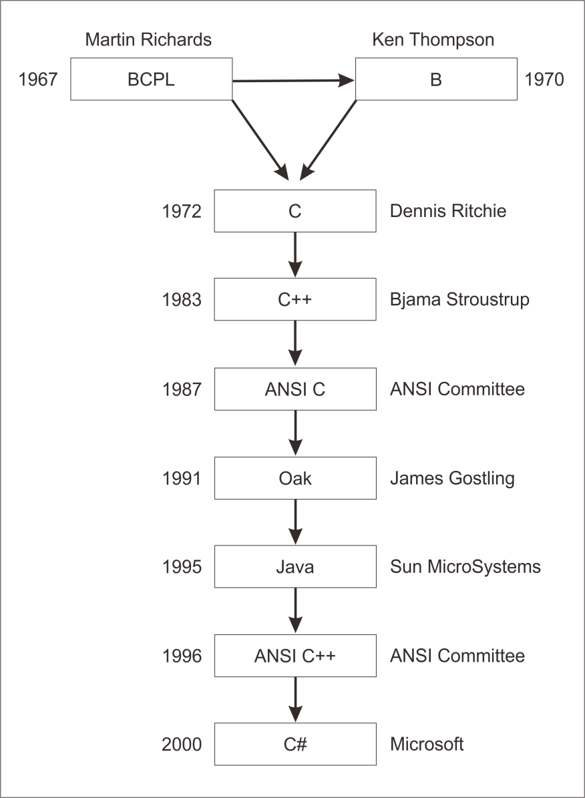

# Belajar Dengan Jenius C#

## Penulis : Gun Gun Febrianza

## C# History

**C#** (dibaca **“See-Sharp”**) adalah bahasa pemrograman baru yang diciptakan oleh **Microsoft** (dikembangkan di bawah kepemimpinan **Anders Hejlsberg** yang notabene juga telah menciptakan berbagai macam bahasa pemrograman termasuk **Borland Turbo C++** dan **Borland Delphi**). 

Bahasa **C#** juga telah di standarisasi secara internasional oleh ECMA [1]. Seperti halnya bahasa pemrograman yang lain, C# bisa digunakan untuk membangun berbagai macam jenis aplikasi, seperti aplikasi berbasis **desktop** dan aplikasi berbasis web. Bahasa **C#** adalah brand bahasa baru hasil derivasi dari C & C++ Family, bahasa C++++ atau **C#** menyederhanakan dan memodernisasi bahasa C++.

Berdasarkan sejarah pada tahun 1967 **BCPL** dikembangkan oleh **Martin Richards** kemudian **Ken Thompson** mengembangkan bahasa **B** pada tahun 1970, hingga akhirnya menginspirasi **Dennis Ritchie** untuk menciptakan bahasa **C** pada tahun 1972, dilanjutkan oleh **Bjarne Stroustrup** membuat versi **high level language programming** yaitu bahasa **C++** dan seterusnya sampai dengan tahun 2000 akhirnya **Microsoft** menciptakan bahasa C#. 

Alur sejarah pengembanganya dapat dilihat pada gambar di bawah ini :

Bahasa **C#** memiliki tujuh karakteristik unggulan diantaranya adalah sebagai berikut :
1.	**Simplicity**
	Bahasa **C#** menyederhanakan C++ dengan menghapus penggunaan **irksome** operator seperti ->,:: dan **pointer**. 
2.	**Consistent**
Bahasa **C#** mendukung **unified type system** yang melakukan eliminasi terhadap masalah perbedaan **range of integer types.** Seluruh **types** diperlakukan sebagai sebuah **object** dan **developer** bisa mengembangkan **types** dengan mudah.

3.	**Modern**
Bahasa **C#** dikatakan sebagai bahasa modern karena mendukung beberapa fitur diantaranya adalah **Automatic Garbage** **Collection, Decimal Data Type** untuk **financial application**, pendekatan terbaru dalam melakukan **debugging** dan **robust security model.**
4.	**Object Oriented**
Bahasa C# adalah bahasa yang pure mendukung pemrograman berorientasi objek karena menyediakan **encapsulation**, **inheritance** dan **polymorphisme.**
5.	**Type-safe**
**Type safety** memberikan kehandalan kompiler pada pembuatan program, misal sebagian diantaranya adalah saat pembuatan sebuah variabel tanpa nilai dilakukan maka akan menghasilkan **semantic error** dan contoh **type safety** lainya misal akses **array** dengan mengukur **range** yang dimilikinya dan memberikan pengetahuan jika akses ternyata keluar dari **range** atau **out of bound.** 
6.	**Versionable**
Membuat versi terbaru **software module** yang mampu berjalan dengan aplikasi yang telah dibuat sebelumnya. Proses ini disebut dengan **versioning**.
7.	**Compatible**
Dengan **Common Language Specification (CLS) inter-operation** antar bahasa **.Net** bisa dilakukan dan izin akses terhadap **COM** dan **OLE**, dan **windows API.**

---------------------

[1] M. Ali, *Kitab Belajar Pemogramman C#*, Jakarta: Ebook, 2014.