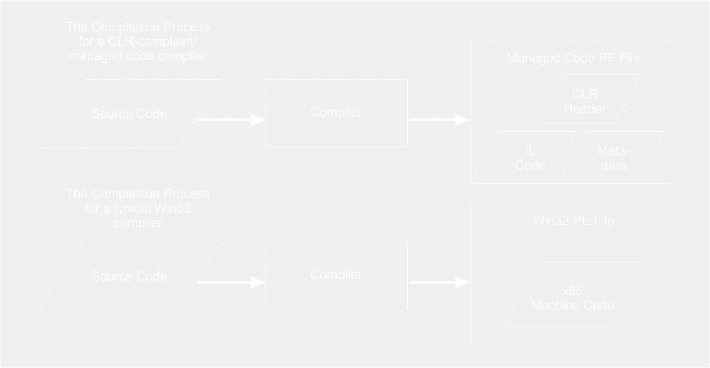
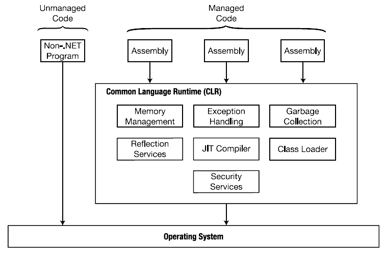

# Belajar Dengan Jenius C#

## Penulis : Gun Gun Febrianza

## Common Language Runtime (CLR)

**Common Language Runtime (CLR)** adalah jantung dari **.Net Framework.** 

**Common Language Runtime (CLR)** adalah sebuah **execution environment** atau **execution engine** yang digunakan untuk memuat dan mengeksekusi sebuah kode. Sebuah kode yang berjalan di atas **CLR** disebut dengan **Managed Code** dan sebuah kode yang dibuat khusus untuk **Win32 executable** dan **Dynamic link libraries (DLLs)** disebut dengan **Unmanaged Code**. 

Dibandingkan dengan **unmanaged code**, pada **managed code** memiliki keunggulan **automatic memory management**, **type safety**, **security**, dan kesempatan untuk berjalan pada **platform** lainya yang didukung oleh **CLR**. 

**CLR-compliant compiler** adalah **compiler** yang melakukan kompilasi dengan suatu bahasa pemrograman tingkat tinggi untuk memproduksi **managed code**. Sebuah **CLR-compliant compiler** tidak melakukan penterjemahan kedalam **native code** seperti pada **Win32 compiler**, penterjemahan kedalam bentuk kode yang bersifat **platform-independent** yang disebut **IL Assembly**. 

Kode **IL Assembly** diselipkan kedalam sebuah **executable** atau **dynamic link library** yang selanjutnya akan diterjemahkan kedalam **native code** oleh **CLR** melalui **JIT Compiler**. 

Sebuah **compiler** yang memproduksi **managed code**, memiliki beberapa perbedaan dengan **Win32 compiler**. Perbedaanya adalah saat proses kompilasi **Win32 compiler** akan membaca **source code**, melakukan kompilasi untuk menghasilkan sebuah **portable executable** yang mengandung **x86 machine code**. 

**Win32 PE File Format** adalah nama untuk **executable** atau **dynamic link library** yang digunakan pada sistem operasi **windows**. Terminologi **portable** digunakan karena **executable** mampu berjalan diberbagai versi sistem operasi **windows**. **CLR-compliant compiler** juga menghasilkan **PE file** hanya saja di dalamnya terdapat **IL code** dan **metadata**.

**CLR-compliant Compiler** dan **win32 Compiler** [1]

Selain itu **Common Language Runtime** juga menyediakan berbagai pelayanan diantaranya adalah :
1.	Memuat dan mengeksekusi sebuah **program** atau **application**.
2.	**Memory isolation** pada sebuah **program** atau **application**.
3.	Verifikasi **type safety**.
4.	Menterjemahkan **IL Assembly** ke dalam **native code**.
5.	Menyediakan **Metadata**.
6.	Manajemen **exception** dan **error**.
**CLR** juga mempunyai peran dalam pengaturan **garbage collection** yang secara otomatis menghapus terjadinya **memory leaks**. Fenomena **memory leaks** terjadi saat sebuah **objects** sudah tidak lagi mengacu pada **Garbage Collection** yang selanjutnya akan dibersihkan agar tercipta manajemen **memory** yang efisien.

**Common Language Runtime** juga menyediakan **JIT Compiler** untuk melakukan **JIT compilation** yang digunakan untuk menerjemahkan **IL Code** atau **managed code** kedalam **Native Code**. Terdapat tiga macam **JIT Compile**r pada **.Net Framework** yaitu :

---------------------

[1] Gordon, Alan. "The CLR", *.NET and COM Interoperability Handbook*. 2002. : Prentice Hall. pp 17