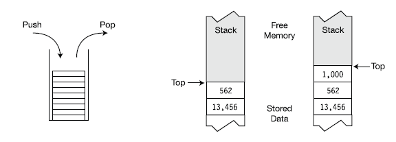

# Belajar Dengan Jenius C#

## Penulis : Gun Gun Febrianza

## Common Type System (CTS)

**Common Type System (CTS)** menjelaskan karakteristik dari **types** yang bisa digunakan dalam sebuah **managed code**. Dalam **Common Language Infrastructure** terdapat dua macam **types** yaitu **Reference types** yang dialokasikan pada **global heap** dan **Value types** yang dialokasikan pada **global stack**. 

#### Stack & Heap

Saat sebuah program berjalan, data harus tersimpan dalam sebuah **memory**, pada program yang sedang berjalan terdapat dua daerah **memory** yang digunakan yaitu **Stack** dan **Heap**. **Stack** merupakan **array of memory** yang mempunyai karakteristik struktur data **last-in**, **first-out (LIFO)**. **Stack** pada **Common Type System** digunakan untuk menyimpan beberapa tipe data.

Ilustrasi **Stack** pada **Common Type System (CTS)** [1]

**Heap** adalah daerah **memory** dimana terdapat alokasi untuk menyimpan **objects** yang selanjutnya bisa dihapus dari **heap**. **Garbage Collector** pada **Common Language Runtime (CLR)** akan secara otomatis membersihkan **heap object** yang sudah tidak lagi diakses. 

Gambar di bawah ini adalah ***Ilustrasi Memory Heap*** pada ***Common Type System* (CTS)** :

Pada ilustrasi gambar di atas terdapat tiga **object** dalam **Heap** : 

Pada gambar 2 salah satu **object** dalam **heap** sudah tidak digunakan lagi, 

Pada gambar 3 **Garbage Collector**menemukan terdapat **object** yang sudah tidak digunakan lagi dan 

Pada gambar ke 4 **object** pada **heap** sudah dibersihkan oleh **Garbage Collector**.

---------------------

[1] Solis, Daniel.M*.* "Types, Storage & Variable", *Illustrated C#* USA : Appress, 2012. pp 41
