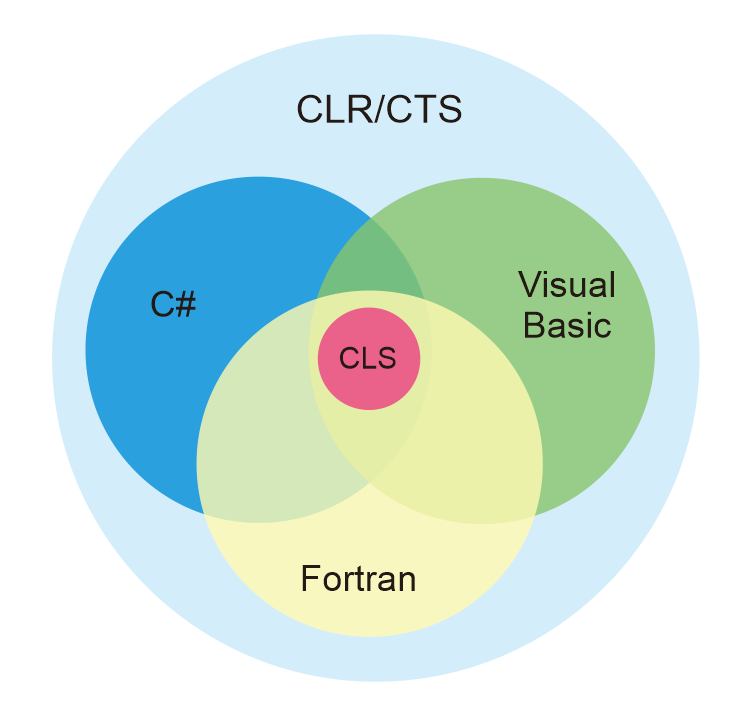

# Belajar Dengan Jenius C#

## Penulis : Gun Gun Febrianza

## Common Language Specification (CLS)

**Common Language Specification (CLS)** adalah penjamin agar **interoperability** antar **.Net Application** bisa berjalan dengan baik. **CLS** memanajemen **type** agar bisa digunakan secara konsisten untuk memiliki **compability** dengan **CLS-compliant language** lainya, sebagai contoh pada **visual basic** bahasa pemrograman bersifat **case sensitive** sementara pada **Fortran** tidak. 

---------------------

