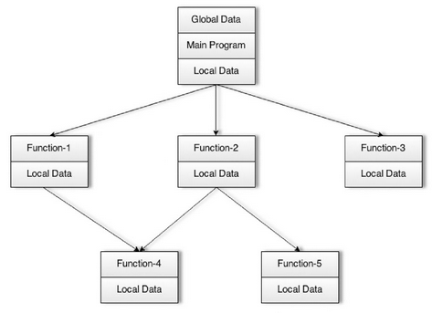
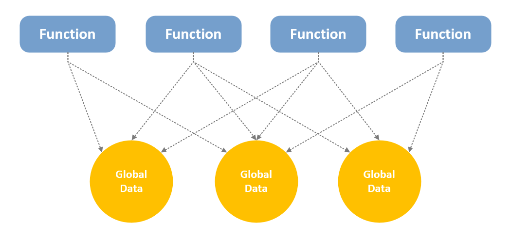

# Belajar Dengan Jenius C#

## Penulis : Gun Gun Febrianza

## Imperative & Declarative Programming

Paradigma pemrograman yang paling umum adalah **imperative programming** dan **declarative programming**. Pada Paradigma Pemrograman **imperative** seorang **programmer** memberi perintah kepada mesin komputer untuk mengeksekusi **step by step** perintah yang diberikan untuk mendapatkan suatu hasil. 

Contoh **imperative programming** adalah bahasa C. Secara kontras berbeda dengan Paradigma Pemrograman **declarative**, seorang programmer memberikan perintah agar mesin komputer mengeksekusinya namun tidak pernah tahu apa yang terjadi dibelakangnya [1]. 

Contoh declarative programming adalah SQL. 

Bahasa pemrograman yang termasuk  kedalam paradigma **imperative** adalah **procedural programming** dan bahasa pemrograman yang termasuk kedalam paradigma **declarative programming** **adalah functional programming**. Paradigma pemrograman **imperative** diawali dari **FORTRAN** dan paradigma pemrograman **declarative** diawali sebelum **LISP** [2]. 

Bahasa pemrograman yang termasuk kedalam **procedural programming** adalah bahasa **COBOL, FORTRAN, ALGOL, BASIC** dan **C**. Selain **imperative** dan **declarative programming** terdapat juga paradigma pemrograman **object oriented programming,** paradigma **object oriented programming** membuka banyak perspektif dalam konsep **software** dan diterima sebagai bagian dari solusi saat terjadi fenomena **software crisis** [3]. 

Masa transisi dari **procedural programming** ke **object oriented programming** terjadi karena **object oriented programming** berhasil membuat **procedural programming** terlihat **obselete**.  Esensi sistem pemrograman adalah berurusan dengan data dan **function** untuk mengubah suatu data. 

Pada **procedural programming** sebuah **function** atau **procedure** digunakan untuk mengubah suatu data. Sebuah **function** mengandung sekumpulan instruksi untuk melakukan pekerjaan tertentu. Sebuah **function** akan menerima **input**, melakukan pekerjaan tertentu dan menghasilkan **output**. 

Penekanan **function** adalah ciri khas dalam **procedural programming**. Hampir sebagian besar bahasa pemrograman awal menggunakan paradigma pemrograman **imperative** dengan gaya **procedural programming**. Pada pemrograman procedural sebuah **function** tidak memiliki relasi dengan data yang dioperasikan. 

Pada pembangunan aplikasi sekala besar sebagian besar data dibagikan untuk berbagai **function** dan sebuah **function** bisa melakukan akses pada **shared** atau **global data**. Ini membuat pengembangan **procedural programming** semakin kompleks karena harus terfokus pada **function** daripada data.

**Procedural Oriented Programming** :

Pada **Procedural Oriented Programming (POP)**, setiap kali proyek baru dibuat dan membutuhkan tempat penyimpanan maka sebuah variabel harus dibuat. Agar bisa bekerja dengan berbagai **function** yang telah dibuat maka variabel harus dibuat menjadi global. Jika ingin menambah fitur maka **function** baru tinggal dibuat, namun memiliki kemungkinan **global data** yang telah disimpan sebelumnya perlu dimodifikasi ulang agar bisa bekerja dengan **function** yang baru dibuat.

Cara **Function** akses Data dalam **POP** :

Saat skala proyek semakin besar proses pembuatan fitur baru akan menjadi sangat kompleks, karena semua **global variable** yang telah menyimpan data dan **function** yang memodifikasinya harus diingat. Kekurangan **procedural programming** juga menjadi penyebab **“Software Crisis”** yang terjadi pada **industry software** dimasanya. Kekuranganya diantara lain adalah :

1.	Terfokus pada **function** daripada data.
2.	Pada program dengan skala yang besar, sulitnya melakukan identifikasi global data dan **function** yang mengubahnya 
3.	Semakin banyak **global data** yang digunakan kemungkinan **error** semakin meningkat dan sulitnya **maintenance code**.
4.	Sulitnya mengelola intergritas data
5.	Modifikasi pada **global** data artinya memodifikasi seluruh **function** yang terikat dengan **global data**.
Sehingga untuk mengatasi **software crisis** ini **Object Oriented Programming** diperkenalkan untuk mengatasi kekurangan yang dimiliki oleh **Procedural Oriented Programming**. 

---------------------

[1] Costa, Cecil. "Introduction to Reactive Programming", *Reactive Programming with Swift*. Birmingham : Packt Publishing. 2016. pp 10

[2] Lundin, Mikael. "Writing Testable Code with Functional Programming", *Testing with F# - Deliver high quality, bug-free application by testing them with efficient and expressive functional programming*. Birmingham : Packt Publishing. 2015. pp 46

[3] Craig, Iain. "Introduction", *The Interpretation of Object Oriented Programming Languages*. London : Springer. 2002. pp 1