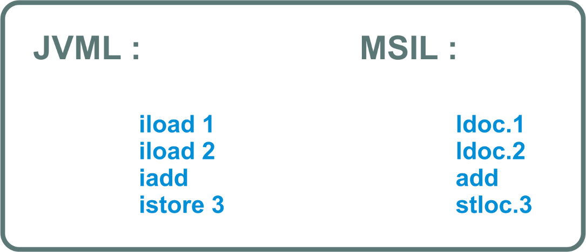

# Belajar Dengan Jenius C#

## Penulis : Gun Gun Febrianza

## JVM & CLR

Sebagai contoh pada bahasa C# dan VB.Net terdapat **CLR (Common Language Runtime)** yang secara konseptual dengan **JVM** keduanya adalah identik sebagai **Runtime Infrastructure.** 

Tetapi **JVM (Java Virtual Machine)** hanya untuk bahasa Java dan representasi **bytecode** diterjemahkan menggunakan **interpreter**, sementara pada **CLR (Common Language Runtime**) representasi **bytecode** diterjemahkan menggunakan **compiler** dan terdapat dukungan untuk berbagai bahasa seperti **IL Assembly, IronPython, IronRuby, F#, C++/CLI, C#, VB.Net** dan sebagainya.

Contoh **Bytecode Representation** :

Pada gambar di atas terdapat representasi **bytecode** untuk **JVM** (sebelah kiri) dan **CLR** (sebalah kanan). 

Satu hal yang menjadi pembeda dari keduanya adalah pada **CLR** representasi **bytecode** akan di **compile** ulang menggunakan **JIT Compiler**, sementara pada **JVM bytecode** akan diterjemahkan menggunakan interpreter khusus.

----------

