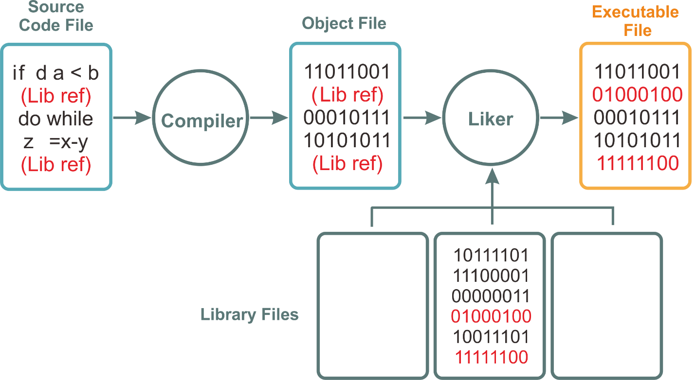

# Belajar Dengan Jenius C#

## Penulis : Gun Gun Febrianza

## Object Code

**Object Code** adalah **machine language** yang telah dikompilasi atau sebuah **Object module** yang diproduksi oleh **assembler** di dalam proses **translation**. 

Secara umum **object code** terdiri dari sekumpulan **statement** atau **instruction** yang dapat direpresentasikan dalam **machine language** atau **intermediate language** tergantung tipe **compiler** dan **target language** yang diproduksi suatu **compiler**. 

Sekumpulan **Object Code** disebut dengan **object files** yang selanjutnya akan dibentuk menjadi sebuah **executable file** atau **library file** oleh program yang disebut **Linker** [1]. 

---------------------

[1] Gosselin, Don. "Introduction to Programming and Visual C++", *Microsoft Visual C++ .NET*. : Cengage. 2010. pp 10