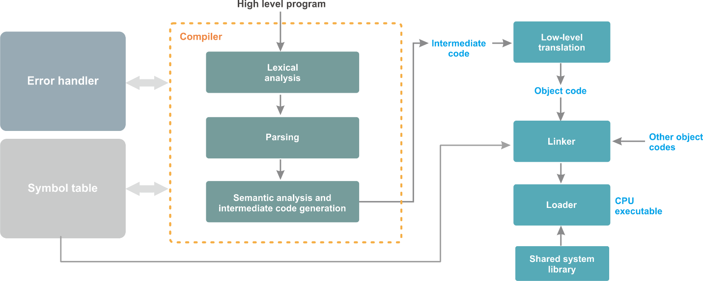

# Belajar Dengan Jenius C#

## Penulis : Gun Gun Febrianza

## Two-Stage Translation

**Modern-day Compilers** menggunakan **Two-stage Translation** untuk mengeksekusi **high-level language** agar bisa berjalan diberbagai arsitektur mesin komputer. Sehingga tantangan untuk menghadapi perbedaan bahasa **Assembly** bisa dihadapi, sebab setiap **Architectures** memiliki bahasa **Assembly** yang berbeda beda sebagai contoh pada **Architectures Intelx86** dan **ARM** keduanya memiliki **Assembly Language** yang berbeda. 

Dengan begitu peluang besar untuk membuat kompiler yang bisa berjalan pada **Multiple Architectures** bisa diwujudkan. 
Untuk diwujudkan sebuah **Intermediate Code** telah dikembangkan dalam dunia pemrograman. 

Pada **stage** pertama kompiler menerjemahkan **high-level language** ke **Intermediate-level Code** dan stage kedua menerjemahkan **Intermediate-level** **Code** ke **Low-level Machine Code**. 

**Stage** pertama penerjemahan terdiri dari :

1. **Lexical Analysis**, 
2. **Parsing**, 
3. **Semantic Analysis** dan 
4. **Code Generation** dengan **Target Language** untuk memproduksi **Intermediate Language**.

Sebagai contoh kompiler yang digunakan untuk pemrograman C# menggunakan **schema Two Stage Translation. CIL Generator** akan menghasilkan **target language** berupa **IL Assembly.** 

**Stage** selanjutnya adalah **IL Assembly** sebagai **intermediate language** diterjemahkan kedalam **Low-level Machine Code** oleh sebuah program bernama **IL Assembler.** Di bawah ini adalah contoh **Intermediate Language Target** :

Pembuatan **Compiler** menggunakan **IL Assembly** baik itu dalam skala **Academic Project** sampai ke **Industrial Strength System** juga sudah dilakukan oleh beberapa universitas dan perusahaan besar diantaranya adalah :
1.	Ada# (USAF Academy, Colorado)
2.	Alice.NET (Saarland University, Saarbrücken)
3.	Boo (codehaus.org)
4.	NetCOBOL (Fujitsu)
5.	COBOL2002 for .NET Framework (NEC/Hitachi)
6.	NetExpress COBOL (Microfocus)
7.	CommonLarceny.NET (Northeastern University, Boston)
8.	CULE.NET (CULEPlace.com)
9.	Component Pascal (Queensland University of Technology, Australia)
10.	Fortran (Lahey/Fujitsu)
11.	Hotdog Scheme (Northwestern University, Chicago)
12.	Lagoona.NET (University of California, Irvine)
13.	LCC (ANSI C) (Microsoft Research, Redmond)
14.	Mercury (University of Melbourne, Australia)
15.	Modula-2 (Queensland University of Technology, Australia)
16.	Moscow ML.NET (Royal Veterinary and Agricultural University, Denmark)
17.	Oberon.NET (Swiss Federal Institute of Technology, Zürich)
18.	S# (Smallscript.com)
19.	SML.NET (Microsoft Research, Cambridge, United Kingdom) [1]

---------------------

[1] Lidin, Serge, ".Net IL Assembler," in *Introduction*, California : Appress, 2014, p. xxviii.